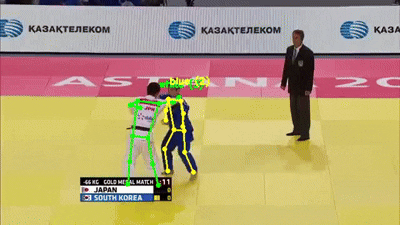

# Grappling with the Data

Can we leverage judo coaching with the use of Deep Learning?

## Why an AI Judo Coach?

Pose estimation has been an upcoming field for many other sports such as boxing and tennis but with judo being a comparatively niche sport (at least in Scotland), there's a lack of pose AI judo analysis on the market.

One thing i noticed when I started Judo at University was that there's only 2 coaches for a club with 100 people in it. We all film our fights at competitions so our coaches can watch them back with us and get advice, however, if they had to do this for even 40 people that all had 4 fights that each averaged 3 minutes in length they would have to spend 8 hours watching them all back - and that's just for 1 competition!

An AI Judo post match analysis tool would be able to:

- Pinpoint key moments in the fight
- Provide feedback on the fight

This would down the massive workload for the coaches.

## Initial idea for the model

My initial for the model was to have the model predict if there was going to be a throw given the last n frames of fighting. An Transformer would be Ideal but I'd have to see how much data I could get.

The plan was tp pull the data from YouTube videos of fights from the pros, split them up into intervals of n frames of length and label each video by hand saying: "Type of throw, Timestamp in video, What player attempted the through", etc.

**The Problem**

Around 30% of each video of a judo competition is not actually fighting. They contain filler such as zooming in on coaches, replaying big throw attempts and showing the fighters walk on.

When I used ffmpeg to separate the videos into sub videos, many of them were useless data as they contained this filler content. It was also really slow having media player open every clip separately.

## A Better Approach to the Data

Instead of gambling that the video i clicked on was a usable one, a better approach would be to watch all the videos through (a process I did not realize would take 40 hours!) and label the time stamps in the video where there were through attempts.

I would then use ffmeg to take the n frames before the throw.

### A new model idea

Up until now I had been skeptical about the usefulness of a model that predicts if there was going to be a throw as I'm building a post match analysis tool. Yes it *may* be useful for spotting missed opportunities for throws but I think what would be much more useful for me as a Judo player would be to see where my technique is faltering when I go for a throw.

A much better idea is to have the model locate where in the clip a through occurs (if at all). I can do this by having the model predict a distribution over each frame in the interval.

This model also lets me bootstrap my data collection process as I was relying on locating throw attempts by hand before.

### Gearing the Data towards the new model

The best part about the model change is that the only change i had to make to my dataset was instead of having the throw always occur at the end of the clip, have it occur at a random moment within the n frame interval and label what that frame was.

I then decided on 210 frames for the first model as heuristically I feel it's enough time to show the context before an after the throw attempt

## Settling on the architecture

I now have all the video data labelled (1000 clips containing throw attempts, 1500 not) but if I were to put the bit map of each frame into my 8GB VRAM GPU, it's never going to work.

I needed a way of turning the frames into tensors

## Leveraging Pose Estimation

I'd first seen pose estimation about 7 months ago at an AI competition and had been wanting to explore it further since but hadn't had the chance until now.

What I settled on for the data was to use the Ultralytics YOLO v11 model for pose extraction from the 2 fighters. I could then concatenate the numpy array for each players skeleton to form the vector for each frame. I'd then have a sequence for my LSTM made up of these vectors.

### Dealing with the challenges of pose estimation

I experienced a few key issues with the pose estimation initially:

- Poor camera angles/Switching cameras
- How do i track the 2 fighters and no-one else?
- High occlusion nature of judo

My solutions were:

##### Poor Camera Angles/Switching cameras

Since in most sequences I had enough good frames i could use frame interpolation to fill in the gaps

##### Tracking the 2 fighters only

The lucky thing with high level judo competitions is that one player wears a white suit and the other wears a blue suit.

I quickly realized that 99% of the time the players had to be the people in the video that were:

1. The biggest skeleton wearing white
2. The biggest skeleton wearing blue

This is because the players are usually closest to the camera

##### High occlusion nature of judo

As long as i have to key idea of the skeleton, I'm okay. It would be naive to try and track every single joint on their body but as long as i know each player's:

- Right Hip
- Left Hip
- Left Elbow
- Right Elbow
- Head
- Right ankle
- Left Ankle

Then I'm okay!

Thankfully Ultralytics YOLO v11 returns these for each skeleton

## What’s Next?

With 2,500 labeled skeleton sequences, the Data centric phase is over. Now, the real fight begins: **Training the LSTM to understand the physics of a throw.**