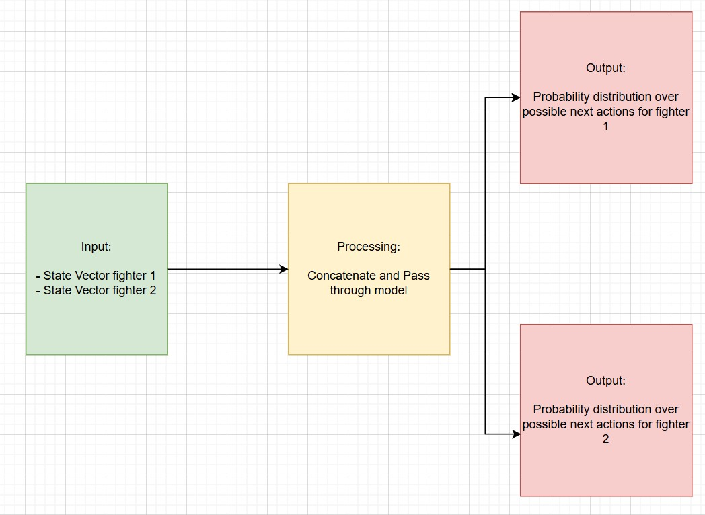

# Predicting Judo Throw Attempts Using Time Series Analysis  

## The Idea  
High-level judo players generally only attempt throws when they’re in a strong position.  
That raises an interesting question: **how could a computer recognize when one judoka has an advantage over the other?**  

Since I’m also interested in applying deep learning to predict financial markets, I naturally drifted towards **time series analysis** as the approach.  

My hypothesis: given the last *t* seconds of movement, it should be possible to predict whether a judoka is about to attempt a major throw.  

## Potential Real World Impact  
On a personal level, if this algorithm were trained on data from professional matches, I could use it to analyze my own fights - spotting opportunities where I *might* attempt a throw if I were in the same position.  

More broadly, the concept could extend far beyond judo:  
- **Sports** → Predicting critical moves in other competitive games.  
- **Engineering** → Anticipating structural failures (e.g., bridges) from time series sensor data.  
- **Healthcare** → Using cameras or sensors to detect early warning signs of strokes, seizures, or falls.  

For now, though, I’ll stick with judo - it’s easier to get data for (something I’ve struggled with in other projects) and it’s an activity that plays a big role in my life.  

## Choosing the Time Interval  
As stated, I want to use the last *t* seconds of fighting as a predictor, but I never actually chose *t*.  

Heuristically, 5 seconds feels like enough time leading up to a moment to capture the flow of the fight without being overwhelmingly long. That will be my starting point, though later I may test different window sizes.  

## How Can a Computer Understand a Fight?  
The first idea that came to mind was to use a convolutional neural network on the raw video. But that would mean processing 70+ frames per 5-second clip - far too heavy for my Raspberry Pi or my budget.  

Instead, I turned to **skeleton modeling**. Each fighter can be represented as a skeleton (joint coordinates per frame), which I compress into a state vector. By fusing the state vectors of both fighters per frame, I get a sequence that represents the fight.  

This naturally led me to think of each fighter as an *agent*, with their skeleton being the observable state. The supervised task is then: *given the last 5 seconds of skeleton states, predict the probability of a throw attempt (forward, backward, or none).*  

## Picking the Time-Series Model  
Rather than committing to a single approach, I’ll try a few and see which works best.  

- **RNN** → Very simple and computationally light, but may struggle if sequences are too long.  
- **LSTM** → A stronger candidate for longer sequences since it mitigates vanishing gradients, though slightly heavier to run.  
- **Transformer** → The most powerful for long-range dependencies and parallel training, but also the most data and compute-hungry.  

## Narrowing The Task
Before moving forward, it’s important to clearly define the task.

Here’s what we’re trying to predict for the last point in a sequence:

For a given fighter, we want a distribution over possible outcomes:

Forwards Throw – the fighter throws their opponent in the direction their toes are pointing.

Backwards Throw – the fighter throws their opponent in the opposite direction.

No Throw – the fighter doesn’t attempt a throw at all.

In other words, after the last 5 seconds of fighting, we want to predict the likelihood of each of these outcomes.

TL;DR: The model will take in two state vectors, concatenate them, and pass them through a neural network. This process will be repeated for every point in the sequence. When we reach the final point, the model will output two probability distribution vectors, one for each type of throw.

## Gathering The Data
Now that we know what our model wants, it's time to get our data.

Youtube has many judo matches which my model can take in and analyze so I'll take videos from there. Since I want at least 60,000 framess worth of data, I'll pull 13 videos from youtube (all of varying lengths) which should give me around n matches
/////////////////// change n once ik how many matches.

